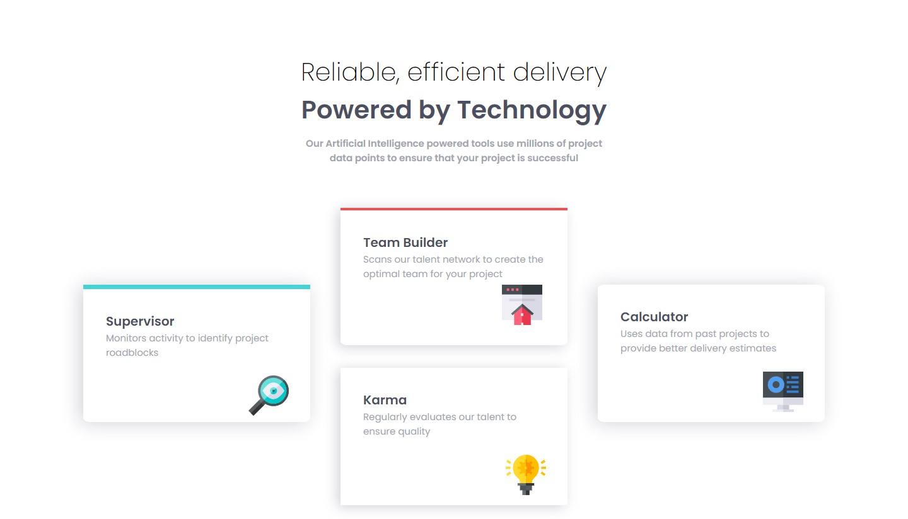

# Frontend Mentor - Four card feature section solution

This is a solution to the [Four card feature section challenge on Frontend Mentor](https://www.frontendmentor.io/challenges/four-card-feature-section-weK1eFYK). Frontend Mentor challenges help you improve your coding skills by building realistic projects.

### The challenge

Users should be able to:

- View the optimal layout for the site depending on their device's screen size

### Screenshot

### Links

- Solution URL: [Four card feature](https://652ea5ecd4e1841a621214b1--endearing-centaur-10470b.netlify.app/)

### Built with

- Semantic HTML5 markup
- CSS custom properties
- Flexbox
- Mobile-first workflow

## Author

- Frontend Mentor - [@Campiottocodes](https://www.frontendmentor.io/profile/Campiottocodes)
- LinkedIn - [Vinicius Campiotto](https://www.linkedin.com/in/vinicius-campiotto-421233250/)
